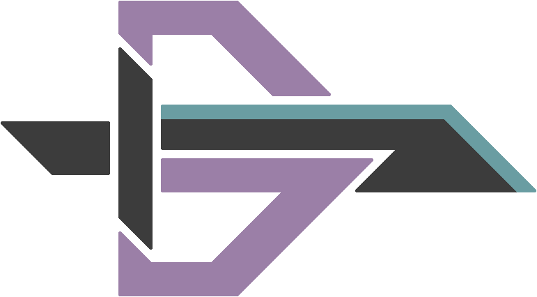

# Gurthang

During my M.S. degree at Virginia Tech, I worked with
[Dr. Godmar Back](https://people.cs.vt.edu/~gback/)
to create [Gurthang](https://github.com/cwshugg/gurthang),
a fuzzing framework capable of fuzzing web servers.
Designing, implementing, and evaluating Gurthang comprised my thesis, which I
officially completed in June 2022.
I successfully defended Gurthang to my advisor committee on May 5th, 2022.
My thesis has been archived electronically and can be found
[at this link](https://vtechworks.lib.vt.edu/handle/10919/110769).
([local mirror](assets/cwshugg_vtcs_thesis_gurthang.pdf))

### What does it do?

Gurthang hooks into [AFL++](https://aflplus.plus/)
and the target web server with our custom mutator module and LD\_PRELOAD library.
Gurthang can create multiple concurrent connections to the web server and
send different test cases across those connections in a single iteration
of the fuzzer. It can mutate both the data sent to the web server *and*
the manner in which that data is delivered. We accomplished this without having
to modify AFL++ *or* the target web server's code at all.

When designing Gurthang, we wanted to create something that could fuzz a web
server by sending *multiple* test cases across *multiple* concurrent
connections in a single iteration of AFL++.
Part of my design was the Comux file format (short for
**co**nnection **mu**ltiple**x**ing). Each of these files are organized
to specify:

- The number of connections to create with the server.
- The data to be sent across each of these connections.
- The order in which this data will be sent to the web server.
- How the data will be segmented and sent across different "chunks" over time.

With all of this information specified in a single comux file, we can not only
fuzz *what* is being sent to the web server, but also *how* it's being
sent to the web server. This means Gurthang can fuzz for bugs in the web server's
concurrency model and its ability to handle unpredictability in connection ordering
and parsing message boundaries.

### Does it work?

Yes it does! Thanks to the awesome students enrolled in Virginia Tech's
[CS 3214 - Computer Systems](https://cs.vt.edu/Undergraduate/courses/CS3214.html)
course in the fall 2021 semester, Gurthang found a number of bugs across
web servers these students implemented as part of their project work. I also
spent time evaluating Gurthang further by fuzzing the Apache and Nginx HTTP
web servers. Turns out, it was capable of fuzzing both Apache and Nginx without
having to modify a *single* line of their source code. Past approaches have
required this, so I consider this a win for my research.

### Can I use it?

Absolutely. My implementation is open-sourced on
[GitHub](https://github.com/cwshugg/gurthang).
Give it a shot!

### Where did the name come from?

So glad you asked. Gurthang comes from J.R.R. Tolkien's world of Arda, during the
First Age of Middle Earth. It was a great sword forged from a meteorite and could
cut through iron. It passed through a number of owners until, through tragedy,
it came into the hands of Túrin Turambar. He wielded Gurthang and became known
as Mormegil, The Black Sword of Nargothrond.
Túrin slew Glaurang the dragon, a dark creation of Morgoth, only to later throw
himself on the blade in suicide. It is said Túrin will return in the Dagor Dagorath
to deal Morgoth a fatal blow.

[Read more about it here!](http://tolkiengateway.net/wiki/Gurthang)

